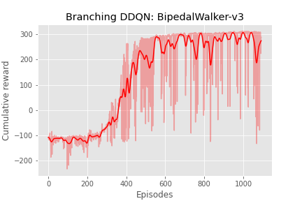

# Keras implementation of Branching Dueling Q-Network (BDQ algorithm) 

This is an implementation of a Keras version of Branching Double Deep Q-Learning. It is based on https://github.com/MoMe36/BranchingDQN and on the paper https://arxiv.org/pdf/1711.08946.pdf and their implementation https://github.com/atavakol/action-branching-agents/tree/master/agents/bdq

BDQ allows a Q-Learning agent to select multiple actions simultaneously, it scales linearly with the action space dimension, thus solving the 'curse of dimentionality' for the DQN algorithm. The same principle could be used for other algorithms also to solve the 'curse of dimensionality problem'... 

The BDQ implementation in Keras is demonstrated on `BipedalWalker-v3` environment.


## How to use: 

To train an agent, run: 

```bash
python bdq_tf.py
```

To see the agent perform: 
```bash
python enjoy_tf.py
```

## Performances


